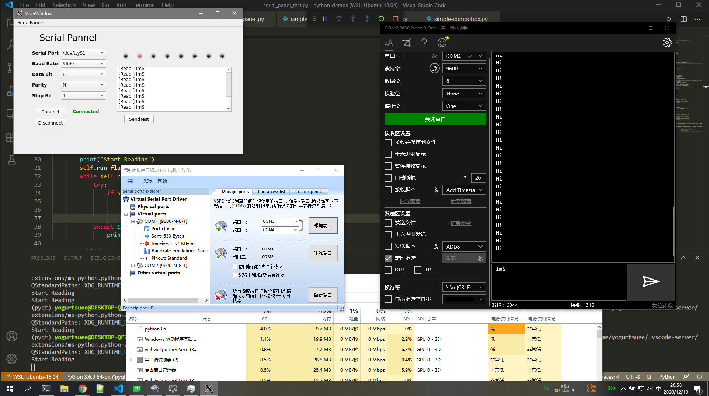

# python-demos for modbus client



## virtual env guide

[virtual env guide](https://www.cnblogs.com/freely/p/8022923.html)

## pyqt5-demo

### We need

* show some static text
* serial comm panel
* led indicator for io signal
* plot line for analog signal

```
pyuic5 -o serial_panel.py serial_panel.ui
```

### serial panel

`pip install pyserial`

### modbus_tk rtu

[ref](https://www.cnblogs.com/siyun/p/10158444.html)

`pip install modbus_tk`

```
READ_COILS   H01  读线圈
READ_DISCRETE_INPUTS    H02  读离散输入
READ_HOLDING_REGISTERS  H03  读寄存器
READ_INPUT_REGISTERS    H04  读输入寄存器
WRITE_SINGLE_COIL   H05  写单一线圈
WRITE_SINGLE_REGISTER   H06  写单一寄存器
WRITE_MULTIPLE_COILS    H15  写多个线圈 
WRITE_MULTIPLE_REGISTERS    H16  写多寄存器 
```
run `python modbus-tk-slave.py`, command `set_values 1 0 0 1 2 3`
and run `python modbus-tk-master.py` get value `(1,2,3)`

### config params

get/set config params with pyyaml

## mqtt-demo

### Mosquitto

#### install
1. [install guide](https://mosquitto.org/blog/2013/01/mosquitto-debian-repository/)
2. and run `sudo apt install mosquitto-clients`
3. [config user group](https://www.cnblogs.com/yangyangming/p/12628209.html)
4. [config item list](https://www.cnblogs.com/chen1-kerr/p/7258487.html)
5. [set id and passwd](https://www.cnblogs.com/zkwarrior/p/10950294.html)

#### test
run instruction under 3 terminal
```bash
mosquitto -c /etc/mosquitto/mosquitto.conf -v # run service
mosquitto_sub -v -t richie -p 1883 # run server
mosquitto_pub -t richie -m hello -p 1883 # run client
```

#### simple-demo

[paho-mqtt-API](https://www.cnblogs.com/lnn123/p/10837754.html)

[mqtt-simple-server](./mqtt-demo/mqtt-simple-server.py)
[mqtt-simple-client](./mqtt-demo/mqtt-simple-client.py)

#### image-transport

[mqtt-image-transport](https://gist.github.com/WakeupTsai/6cac70f8e9f26cc909e9223346580a0f)