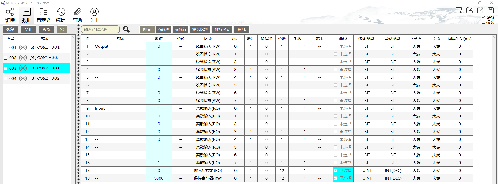
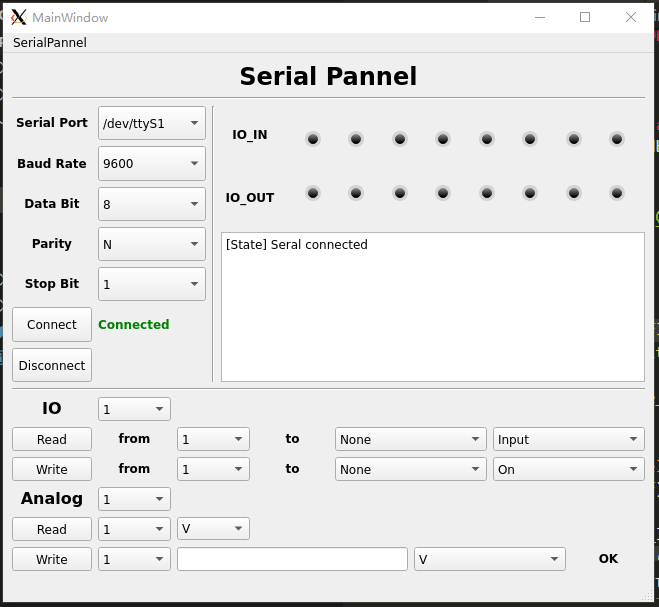
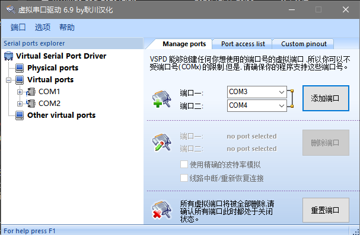
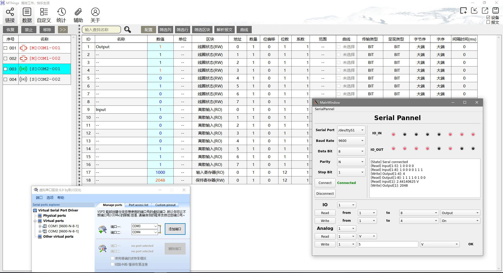

# Modbus master Panel

Modbus master Panel based on [modbus-tk](https://github.com/ljean/modbus-tk) , [Pyqt5](https://pypi.org/project/PyQt5/), [qt-led](https://github.com/Neur1n/pyqt_led).

## Mthings Simulator

## Modbus master Panel

## Simulation

simulation screen shot

## Other

old README moved to [note.md](./note.md)